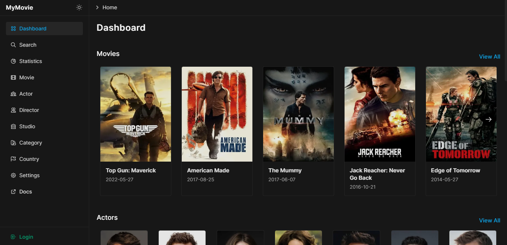

import { Card, Cards } from "@components/cards";
import {
  UserGroupIcon,
  ChartPieIcon,
  MagnifyingGlassIcon,
  ArrowRightOnRectangleIcon,
	FilmIcon,
	UsersIcon,
	BuildingLibraryIcon,
	FlagIcon,
	SwatchIcon
} from "@heroicons/react/24/outline";

# Introduction
 
Welcome to MyMovie REST API documentation. From here you can easily discover all available REST APIs with the required information on how to consume it.

## What is MyMovie?

Information and statistics about movies, TV shows as well as actors, directors and other film industry professionals.

## Database

Import data directly from a CSV or excel spreadsheet to **Supabase**.

[CSV](https://github.com/wahid-ari/next-supabase-movie-docs/tree/master/public/supabase-csv)

## Postman

You can import collections or your API specifications directly into Postman.

Export Collection v2.1 > [JSON](/Next-Supabase-Movie.postman_collection.json)

Export Collection v2.1 > [JSON](https://github.com/wahid-ari/next-supabase-movie-docs/blob/master/public/Next-Supabase-Movie.postman_collection.json) (github)

Export Collection v2.1 > [JSON](https://github.com/wahid-ari/next-supabase-movie-docs/raw/master/public/Next-Supabase-Movie.postman_collection.json) (download)

## Documentation

Discover our REST API documentation

<Cards>
	<Card
		icon={
			<ArrowRightOnRectangleIcon className="w-6 h-6" />
		}
		title="Login"
		href="/login"
	/>
	<Card
		icon={
			<MagnifyingGlassIcon className="w-6 h-6" />
		}
		title="Search"
		href="/search"
	/>
	<Card
		icon={
			<ChartPieIcon className="w-6 h-6" />
		}
		title="Statistics"
		href="/statistics"
	/>
	<Card
		icon={
			<FilmIcon className="w-6 h-6" />
		}
		title="Movie"
		href="/movie"
	/>
	<Card
		icon={
			<UserGroupIcon className="w-6 h-6" />
		}
		title="Actor"
		href="/actor"
	/>
	<Card
		icon={
			<UsersIcon className="w-6 h-6" />
		}
		title="Director"
		href="/director"
	/>
	<Card
		icon={
			<BuildingLibraryIcon className="w-6 h-6" />
		}
		title="Studio"
		href="/studio"
	/>
	<Card
		icon={
			<SwatchIcon className="w-6 h-6" />
		}
		title="Category"
		href="/category"
	/>
	<Card
		icon={
			<FlagIcon className="w-6 h-6" />
		}
		title="Country"
		href="/country"
	/>
</Cards>